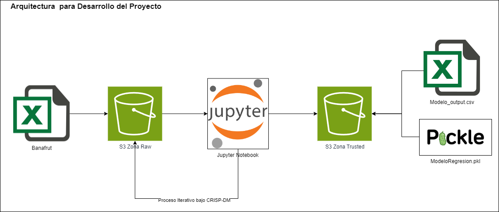
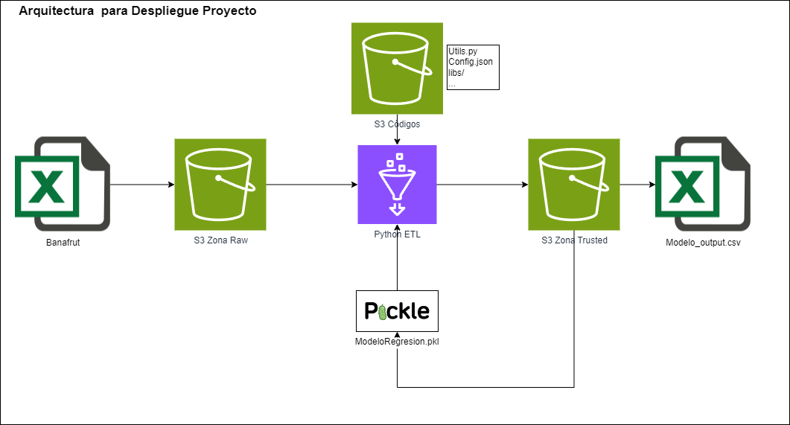

# PI_Banano
Proyecto Integrador MCDA - EAFIT Semestre 2024-I

Modelo Analitico que utiliza datos históricos de suelo, climatología y producción de banano en ciertas ubicaciones determinadas, para predecir el rendimiento de la cosecha de la siguiente semana medido como el Peso en KG del racimo.
Ayudando a los agricultures a tomar decisiones más informadas y estratégicas para mejorar la productividad de las fincas.

## Presentado Por:
- Isaac Hurtado Rivera
- Edgard Iglesias Rubio
- Jorge Mario Zapata Posada
- Laura Catalina González

### Arquitectura del Proyecto 

#### Desarrollo del Proyecto

Bajo la metodología CRISP-DM se plantea el desarrollo del proyecto de forma iterativa utilizando componentes de AWS para almancenamiento de Datos en zona RAW (S3) para los insumos sin transformar, y zona Trusted (S3) para las posibles salidas del modelo, asi mismo en dicha zona Trusted se almacenara el modelo final entrenado en formato PKL para ser utilizado por el código potencialmente productivo.
El desarrollo del Proyecto se hará a través de jupyter notebooks los cuales estan en este repositorio en la carpeta [1 Desarrollo del Proyecto], de forma que permitan trazabilidad de los hallazgos y decisiones tomadas en la construcción de la solución analítica.

#### Despliegue del Proyecto

Al tener el modelo final entrenado y almacenado en zona Trusted en Formato PKL, se construye un código en Python (py) que contiene el Pipeline para la ejecución del modelo en producción. Aplicando las transformaciones de datos identificadas y trabajadas durante el desarrollo del proyecto y permitiendo la generación de predicciones hacia la zona Trusted (S3), para su posterior uso/envío a Banafrut y grupos de interés. 
El código Python así como el modelo ganador están en la carpeta [2 Despliegue] de este repositorio.

### Estructura del Repositorio
```
PI_Banano
│   README.md                                 # Descripcion
|   ArquitecturaDesarrolloProyecto.png        # Diagrama de Arquitectura Desarrollo Proyecto
|   ArquitecturaDespliegueProyecto.png        # Diagrama de Arquitectura Despliegue Proyecto
│   
└───1 Desarrollo del Proyecto                 # Notebooks con el desarrollo del proyecto integrador
|   | 1_Calidad_de_Datos.ipynb                # Validacion de Calidad de Datos
|   | 2_Ingenieria_Caracteristicas.ipynb      # Creacion de Nuevas variables para el modelo
|   | 3_Seleccion_de_Variables.ipynb          # Seleccion de variables metodo de correlaciones
|   | 4_Analisis_Efectos_Datos_Panel.ipynb    # Analisis de comporamiento de los datos históricos como datos Panel
|   | 5_Modelacion_Final.ipynb                # Construcción del modelo Final
|   
└───2 Despliegue                              # Pipeline de ejecución en ambiente Productivo
|   | __init__.py                             # Archivo de Python para que puedan importarse funciones de otros archivos py
|   | main.py                                 # Codigo principal del despliegue del modelo
|   | utils.py                                # Codigo Python con las funciones 
|   | config.json                             # Archivo de configuracion dinamico para el codigo principal
|   | requerimientos.txt                      # Archivo con el detalle de las librerias y versiones que necesita el código para funcionar
|   └───logs 
|   |   | pi_banano_20240613_234935.log       # Ejemplo de Bitacora
|   
└───3 Datos                                   # Creacion de tabla Nativa en Redshift y ETL
|   └───1 Raw                                 # Carpeta con datos fuentes emulando zona Raw S3
|   |   | Base datos banano.xlsx              # Archivo fuente par el desarrollo del proyecto
|   |   | Datos_A_Predecir.xlsx               # Archivo de pruebas para el despliegue del modelo
|   └───2 Trusted                             # Carpeta con datos resultantes emulando zona Trusted S3
|   |   | model_predict_20240613_234511.xlsx  # Ejemplo de Prediccion del modelo
|   |   | modeloRegresionLasso.pkl            # Archivo PKL con el modelo final seleccionado
|   
```
