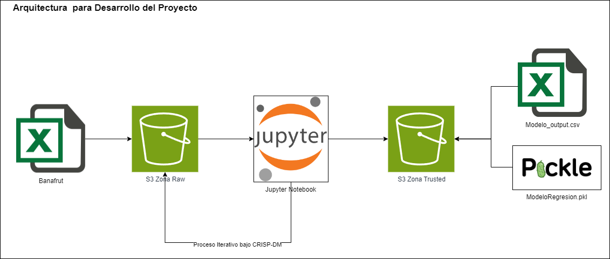
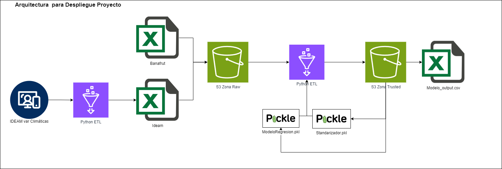

# PI_Banano
Proyecto Integrador MCDA - EAFIT Semestre 2024-I

Modelo Analitico que utiliza datos históricos de suelo, climatología y producción de banano en ciertas ubicaciones determinadas, para predecir el rendimiento de la cosecha de la siguiente semana medido como el Peso en KG del racimo.
Ayudando a los agricultures a tomar decisiones más informadas y estratégicas para mejorar la productividad de las fincas.

##Presentado Por:
• Isaac Hurtado Rivera
• Edgard Iglesias Rubio
• Jorge Mario Zapata Posada
• Laura Catalina González

### Arquitectura del Proyecto

#### Desarrollo del Proyecto

Bajo la metodología CRISP-DM se plantea el desarrollo del proyecto de forma iterativa utilizando componentes de AWS para almancenamiento de Datos en zona RAW (S3) para los insumos sin transformar, y zona Trusted (S3) para las posibles salidas del modelo, asi mismo en dicha zona Trusted se almacenara el modelo final entrenado en formato PKL para ser utilizado por el código potencialmente productivo, tambien se almacenará en dicha zona el scalador entrenado tambien en formato PKL.
El desarrollo del Proyecto se hará a través de jupyter notebooks los cuales estan en este repositorio en la carpeta [1 Desarrollo del Proyecto], de forma que permitan trazabilidad de los hallazgos y decisiones tomadas en la construcción de la solución analítica.

#### Despliegue del Proyecto

Al tener el modelo final entrenado y almacenado en zona Trusted en Formato PKL asi como el Standarizador en formato PKL, se construye un código en Python (py) que contiene el Pipeline para la ejecución del modelo en producción. Aplicando las transformaciones de datos identificadas y trabajadas durante el desarrollo del proyecto y permitiendo la generación de predicciones hacia la zona Trusted (S3), para su posterior uso/envío de Banafrut y grupos de interés. El código Python así como el modelo ganador y standarizador estan en la carpeta [2 Despliegue] de este repositorio.

### Estructura del Repositorio
```
PI_Banano
│   README.md                                # Descripcion
|   diagrama1.png                            # Diagrama de Arquitectura
│   
└───1 Desarrollo del Proyecto                # Notebooks con el desarrollo del proyecto integrador
|   | 1_Calidad_de_Datos.ipynb               # Validacion de Calidad de Datos
|   | 2_Seleccion de Variables.ipynb         # Seleccion de variables metodo de correlaciones
|   | 3_Identificacion_Outliers.ipynb        # Indetificacion de Outliers a traves de d. Mahalanobis
|   | 4_Imputacion_informacion.ipynb         # Imputacion de información faltante
|   | 5_Particionamiento_Modelacion.ipynb    # Particionamiento para modelado Train Valid Test
|   | 6_Ingenieria_Caracteristicas.ipynb     # Modificaciones a los datos y Estandarizacion
|   | 7_Competencia_de_modelos.ipynb         # Entrenamiento de Modelos para definir mejor modelo
|   | 8_Tuneo_Hiperparametros.ipynb          # Tuneo de Hiperparametros de modelos champions
|   | 9_Seleccion_modelo_final.ipynb         # Seleccion y almacenado de modelo final
|   |
└───2 Despliegue                             # Pipeline de ejecución en ambiente Productivo
|   | Pipeline_Productivo.py                 # Ejecucion de Modelo Utilizando AWS
|   | config.json                            # Archivo de configuracion para key y tokens AWS
|   | Standarizador.pkl                      # Standarizador entrenado para uso en Pipeline
|   | ModeloRegresion.pkl                    # Modelo de Regresion Entrenado para uso en Pipeline
|   |
└───3 Datos                                  # Creacion de tabla Nativa en Redshift y ETL
|   └─1 Raw                                  # Carpeta con datos fuentes emulando zona Raw S3
|   | | Banafrut.csv
|   | | Ideam.csv
|   └─2 Trusted                              # Carpeta con datos resultantes emulando zona Trusted S3
|   | | Modelo_output.csv
```
